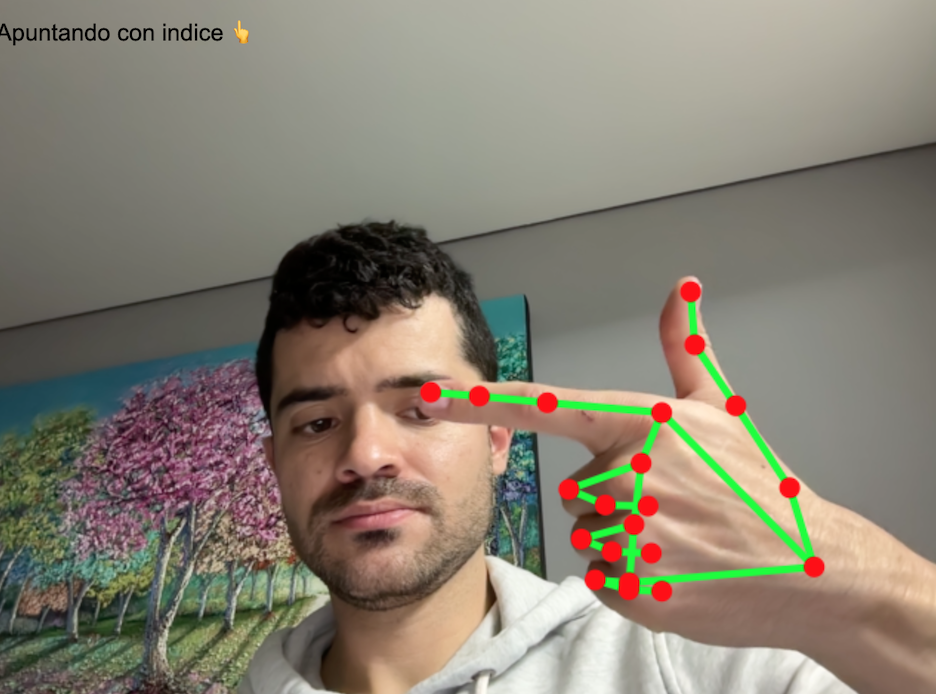
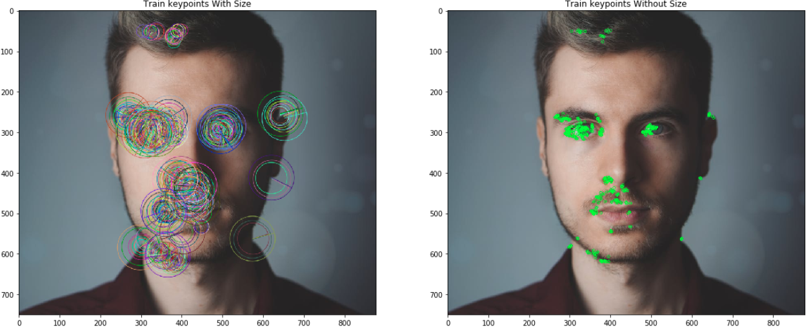
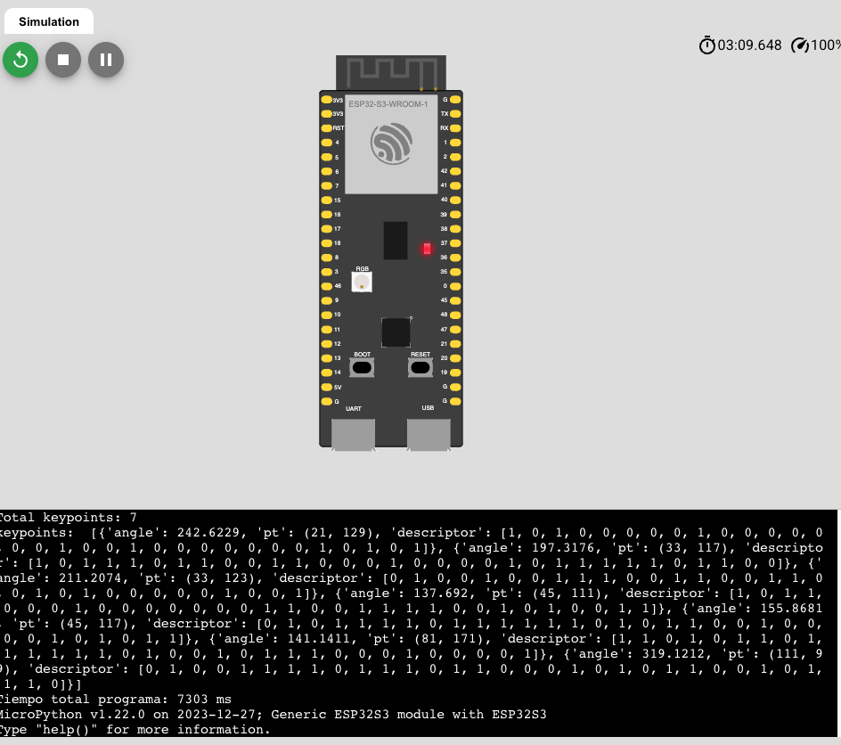

# Documentación de la clase de Machine Learning

**Machine Learning (ML)** es una rama de la inteligencia artificial que permite a las computadoras aprender de datos sin ser programadas explícitamente. Mediante algoritmos, los sistemas identifican patrones, hacen predicciones o toman decisiones basadas en información previa, mejorando su precisión con la experiencia. Se usa en aplicaciones como recomendaciones, reconocimiento de voz, diagnóstico médico y autos autónomos. En esencia, el ML transforma permite generar conocimiento a paritr del entendimiento de los datos.

## Tareas.

Cada una de las tareas conduce a su repositorio en Google Colab

1. [Ejercicio de Rimas](#rimas)
2. [Numpy](#numpy)
3. [Sufijos (tarea Extra)](#sufijos)
4. [Pandas](#pandas)
5. [Maplotlib y hvPlot](#maplotlib)
6. [Reglas de asociacion](#asociacion)
7. [Kaggle](#kaggle)
8. [Hopfield](#hopfield)
9. [Análisis PCA](#pca)
10. [Árboles de Decisión](#arboles)
11. [KNN](#knn)
12. [Vision por computadora](#hand)
13. [Micropython](#micro)

---

### 1. Ejercicio de Rimas <a name="rimas"></a>

**Las rimas en español** son la repetición de sonidos al final de dos o más versos, a partir de la última vocal acentuada. Pueden ser _consonantes_ (iguales sonidos en vocales y consonantes) o _asonantes_ (solo coinciden las vocales). Son clave en poesía, música y juegos infantiles.

_Fuente: Real Academia Española (RAE). "Diccionario de la lengua española" (Ed. 23.ª, 2014)._

[](https://colab.research.google.com/github/ivankarrillin/ML_Doc/blob/main/1_rimas/ejercicio_rimas.ipynb)

---

### 2. Tutorial de Numpy <a name="numpy"></a>

> :warning: Tarea que faltaba

**NumPy** es una biblioteca fundamental para computación científica en Python que proporciona soporte para arrays y matrices multidimensionales, junto con una amplia colección de funciones matemáticas de alto nivel para operar con estas estructuras de datos. Es el paquete básico para computación numérica en Python, permitiendo operaciones vectorizadas y matriciales eficientes, lo que lo hace esencial para aplicaciones de análisis de datos, machine learning, procesamiento de señales y álgebra lineal. NumPy destaca por su rendimiento optimizado (está escrito en C y Fortran) y su sintaxis concisa, siendo la base sobre la que se construyen muchas otras bibliotecas científicas del ecosistema Python como Pandas, SciPy y scikit-learn. Fuente: https://numpy.org/doc/stable/user/absolute_beginners.html

[](https://colab.research.google.com/github/ivankarrillin/ML_Doc/blob/main/2_numpy/numpy.ipynb)

---

### 3. Ejercicio de sufijos (tarea Extra) <a name="sufijos"></a>

[](https://colab.research.google.com/github/ivankarrillin/ML_Doc/blob/main/3_sufijos/ejercicio_sufijos.ipynb)

---

### 4. Tutorial Pandas <a name="pandas"></a>

> :point_up: Se mejora esta tarea

**Pandas** es una biblioteca de Python para análisis y manipulación de datos. Ofrece estructuras eficientes como _DataFrames_ y _Series_, permitiendo limpieza, filtrado, agregación y visualización de datos. Esencial en ciencia de datos, integrable con NumPy y Scikit-learn.

_Fuente: McKinney, W. (2010). "Data Structures for Statistical Computing in Python". Proceedings of SciPy._

[](https://colab.research.google.com/github/ivankarrillin/ML_Doc/blob/main/4_pandas/tutorial_pandas.ipynb)

---

### 5. Maplotlib y hvPlot <a name="maplotlib"></a>

> :warning: Tarea que faltaba

Las librerías **Matplotlib** y **hvPlot** en Python son herramientas poderosas para la visualización de datos. **Matplotlib** es una de las bibliotecas más utilizadas para crear gráficos estáticos en 2D (como líneas, barras, histogramas o dispersión), ofreciendo un control detallado sobre cada aspecto del gráfico, lo que la hace ideal para personalizaciones avanzadas. Por otro lado, **hvPlot** es una interfaz de alto nivel construida sobre bibliotecas como HoloViews y Bokeh, que permite generar gráficos interactivos de forma sencilla a partir de estructuras de datos comunes como pandas DataFrames. Una de las principales ventajas de hvPlot es su capacidad de generar visualizaciones interactivas con muy poco código, ideal para exploración de datos y dashboards, mientras que Matplotlib destaca en su madurez y amplio soporte en el ecosistema científico de Python.

[](https://colab.research.google.com/github/ivankarrillin/ML_Doc/blob/main/5_maplotlib/librerias_graficas.ipynb)

---

### 5. Reglas de asociación <a name="asociacion"></a>

> :point_up: Se mejora esta tarea

Los **algoritmos de reglas de asociación** son técnicas utilizadas en minería de datos para descubrir relaciones interesantes entre variables dentro de grandes conjuntos de datos. Su objetivo principal es identificar patrones del tipo "si ocurre A, entonces probablemente ocurra B", conocidos como reglas de la forma **A ⇒ B**, donde A y B son conjuntos de ítems. Estos algoritmos, como Apriori o FP-Growth, calculan métricas como el **soporte**, la **confianza** y el **lift** para evaluar la importancia y la fiabilidad de estas reglas. Son ampliamente utilizados en aplicaciones como análisis de cesta de mercado, recomendaciones de productos, detección de fraudes y análisis de comportamiento del cliente.

[](https://colab.research.google.com/github/ivankarrillin/ML_Doc/blob/main/5_reglas_asociacion/reglas_asociacion.ipynb)

---

### 6. Tutorial Kaggle <a name="kaggle"></a>

**Kaggle** es una plataforma en línea para competencias de ciencia de datos y aprendizaje automático, donde usuarios comparten datasets, colaboran en proyectos y desarrollan modelos. Ofrece recursos educativos, kernels (notebooks) y acceso a herramientas cloud. Ideal para practicar, aprender y destacar en la comunidad de IA.

_Fuente: Kaggle.com_

[](https://colab.research.google.com/github/ivankarrillin/ML_Doc/blob/main/6_kaggle/tutorial_kaggle.ipynb)

---

### 7. Hopfield <a name="hopfield"></a>

**La red de Hopfield** es un modelo de red neuronal recurrente que almacena patrones como estados estables, actuando como memoria asociativa. Usa aprendizaje hebbiano para recuperar información incluso con entradas parciales o ruidosas. Aplicada en optimización y reconocimiento de patrones, aunque tiene limitaciones en capacidad de almacenamiento.

_Fuente: Hopfield, J. J. (1982). "Neural networks and physical systems with emergent collective computational abilities". PNAS._

[](https://colab.research.google.com/github/ivankarrillin/ML_Doc/blob/main/7_hopfield/Hopfield.ipynb)

---

### 8. PCA <a name="pca"></a>

**PCA (Análisis de Componentes Principales)** es una técnica de reducción de dimensionalidad que transforma datos complejos en componentes ortogonales, ordenados por varianza explicada. Identifica patrones clave, eliminando redundancias y ruido, facilitando visualización y análisis. Usado en imágenes, genómica y finanzas, simplifica modelos sin perder información esencial. ¡Eficaz para datos correlacionados!
_Fuente: Jolliffe, I. T. (2002). "Principal Component Analysis". Springer._

[](https://colab.research.google.com/github/ivankarrillin/ML_Doc/blob/main/8_analisis_pca/PCA.ipynb)

---

### 9. Árboles de decisión <a name="arboles"></a>

**Los árboles de decisión** son modelos de _machine learning_ que dividen datos en nodos mediante reglas **if-else**, basadas en características. Cada nodo representa una pregunta, cada rama una decisión y cada hoja un resultado. Son intuitivos, pero pueden sufrir _overfitting_. Se usan en clasificación y regresión. 🌳📊

[](https://colab.research.google.com/github/ivankarrillin/ML_Doc/blob/main/9_arboles_decision/decision_tree.ipynb)

---

---

### 11. KNN <a name="knn"></a>

El **análisis KNN (K-Nearest Neighbors o K-Vecinos más Cercanos)** es un algoritmo de aprendizaje supervisado utilizado tanto para clasificación como para regresión, que predice basándose en la similitud con los _k_ ejemplos más cercanos en el espacio de características. Su principio fundamental es que observaciones similares tienden a tener resultados similares ("Los vecinos más cercanos constituyen una buena estimación local" — Fix & Hodges, 1951). Este método no asume una distribución subyacente de los datos, lo que lo hace versátil, pero su rendimiento depende críticamente de la métrica de distancia (ej. euclidiana), la selección de _k_ y el escalado de variables. Es especialmente útil en problemas donde las relaciones no son lineales, aunque puede volverse computacionalmente costoso con grandes volúmenes de datos (Tan et al., Introduction to Data Mining, 2016).

[](https://colab.research.google.com/github/ivankarrillin/ML_Doc/blob/main/10_KNN_ejercicio/ejercicio.ipynb)

---

### 12. Ejercicio de detección dedo índice <a name="hand"></a>

[Ver ejercicio](https://ivankarrillin.github.io/ML_Doc/vision_computer/Hand_Detection_LandMark_IvanCarrillo.html)

**Función para encontrar el coseno de dos vectores**

```javascript
function calcularCosenoEntreVectores(landmarks, idx1, idx2, idx3, idx4) {
  const x1 = landmarks[idx2].x - landmarks[idx1].x;
  const y1 = landmarks[idx2].y - landmarks[idx1].y;
  const x2 = landmarks[idx4].x - landmarks[idx3].x;
  const y2 = landmarks[idx4].y - landmarks[idx3].y;

  const producto_punto = x1 * x2 + y1 * y2;
  const norm1 = Math.sqrt(x1 * x1 + y1 * y1);
  const norm2 = Math.sqrt(x2 * x2 + y2 * y2);
  // división por cero (si algún vector es nulo)
  if (norm1 === 0 || norm2 === 0) {
    return 0;
  }

  const coseno = producto_punto / (norm1 * norm2);
  return coseno;
}
```



### 13. Ejercicio de Micropython <a name="micro"></a>

La correspondencia de características es fundamental en muchos problemas de visión artificial, como el reconocimiento de objetos o la estructura a partir del movimiento. Los métodos actuales se basan en descriptores costosos para la detección y la correspondencia. En este artículo, proponemos un descriptor binario muy rápido basado en BRIEF, llamado ORB, que es invariante a la rotación y resistente al ruido. Demostramos mediante experimentos que ORB es dos órdenes de magnitud más rápido que SIFT, con un rendimiento similar en muchas situaciones. Su eficiencia se prueba en diversas aplicaciones del mundo real, incluyendo la detección de objetos y el seguimiento de parches en un teléfono inteligente.

**Ejemplo de uso:**

```python

#Se importa la clase creada en Micropython
from orb_detector import ORBDetector

orb = ORBDetector()

#el algoritmo tiene un método que recibe como párametro de entrada una imagen almacenada como array en un archivo .txt
key = orb.detectar_orb("insumos/imagen.txt")
key1 = orb.detectar_orb("insumos/imagen1.txt")

print("Total keypoints:", len(key))
print("Primeros 5 keypoints:", key[:5])
```

El algoritmo detecta los Keypoints de una imagen que puede ser usado para proyectos de automatización como el seguimiento de un objeto o encontrar un patrón que ya se le ha dado:

**Salida:**



[](https://colab.research.google.com/github/ivankarrillin/ML_Doc/blob/main/Mycropython/Algoritmo-ORB.ipynb)

#### Testeo del algoritmo en un espacio de simulación:

[Ir a Wokwi (simulador MicroPython)](https://wokwi.com/projects/432405849571279873)




